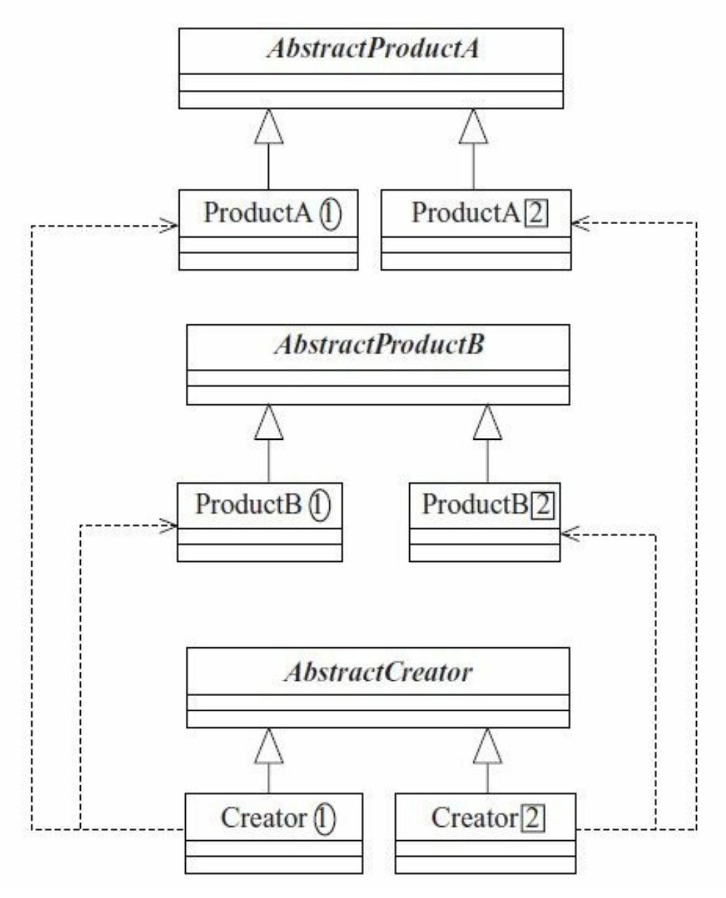

# 单例模式 Singleton Pattern

> Spring中的Bean默认就采用的是单例模式。

**概念：**Ensure a class has only one instance, and provide a global point of access to it.（确保某一个类只有一个实例，而且自行实例化并向整个系统提供这个实例。）

**实现：**把一个类的构造函数设置为私有；然后添加一个静态变量存储单例，给他赋值为new构造函数，即在类初始化的时候创建这个单例；最后再添加一个获取这个单例的方法。

**优：**

- 只有一个实例，资源消耗少。

- 可以避免对资源的多重占用。

  > 因为只有一个实例再内存，所以可以避免例如对同一个文件的同时写操作。
  
- 能提供一个全局的共享访问点。

**缺：**

- 没有接口，扩展困难、变更风险大。

  一般情况下，它因为他是自动实例化的，所以创建接口、抽象类这些也就没有任何意义。

- 没有接口，测试不便。

  因为没接口，所以不能使用mock的方式虚拟一个结果。

- 大概率会和单一职责原则冲突。

**适用场景：**有很多，要求一个类有且仅有一个对象，出现多个对象就会出现“不良反应”的场景。

- 要求生成唯一序列号的场景。

- 整个项目需要一个共享访问点或共享数据。

  > 例如Web页面上的计数器，用单例就可以不用把每次刷新结果放在数据库，也能保证计数器的值正确。

- 创建一个对象需要消耗的资源太多，例如访问IO和数据库等资源。

- 需要定义大量静态常量和方法的环境，例如工具类。

  这一条我觉得比较牵强，只能是说可以这样用。但和你直接把所有静态常量和方法都声明成static，用起来没有太大区别。

**注意：**单例模式中，单例的创建最好直接赋值给静态常量，在类初始化的时候创建，不要把实例的创建写在实例获取方法里(具体一点就是判断静态变量是否为空，是就创建后返回，不是就直接返回)。这会导致线程不安全，因为在多线程的情况下，很可能多个线程同时获取这个实例，线程1获取的时候，方法发现没有，决定创建一个，结果在创建前时间片恰好用完，切换到了线程2，线程2也发现没有，决定创建一个，这样就出现了两个该类的实例，破坏了最初单例的预期。当然如果非要这样做也不是不可以，使用synchronized即可。

> 除此之外还要注意复制的情况，Java里对象默认是不可被复制的，但你实现了Cloneable接口和clone方法，就可以复制了，Java的复制是从语言底层实现的，并不是调用构造函数，在构造函数私有的情况下对象也能被复制。这也可能导致单例预期被破坏。

**扩展：多例模式**

使用new关键字正常执行实例化，可以创建无限的实例；使用单例模式只能创造一种实例；显然还有一种情形就是，我们希望创造指定限制个数的实例。

实现方式和单例一样，只需根据规定的数量限制，在类初始化的时候创建相应个数的实例。然后再按照一定的规则获取某个实例即可。

# 工厂方法模式 Factory Method Pattern

要理解工厂方法模式，需要先从**简单工厂模式（Simple Factory Pattern）**开始了解。

工厂模式是用new方法创建对象的替代，使用工厂模式，专门定义一个类，用于创建其他类的实例，这些类往往都有者共同的父类。这样一来创建这些类时就可以直接调用对应的工厂方法，只需输入正确的参数，就能创建正确的类，将具体创建类的操作交给工厂类来完成。

至于为什么要这么做，我到现在也没搞清楚，我觉得网上说的所谓的好处都比较牵强：

- 如果所有对象都用new创建，大量使用此对象时，假如对象的构造方法或者类名等发生了修改，会造成一连串的修改。根据迪米特原则，应当尽量少的和其他对象交互、知道他们的细节。所以如果使用工厂模式，有一天出现了修改，则只需要修改工厂方法，不需要大规模修改。

  但问题是，你参数名修改了怎么办呢？或者再进一步，下面的工厂方法模式，要给工厂传相应的类.class，那你这个类变量，所有调用处不还是得改吗？这也没解决修改扩散的问题啊？通过向工厂方法输入参数创建和直接new这两种方法我没感受到本质区别，都依旧是强耦合。

- 利用工厂方法创建，则可以在创建的过程中定义一系列的判断、以及伴随创建的动作。

  但这个其实new一个对象也可以实现吧？只需要在对应构造器定义判断以及伴随对象实例化要做的事即可。

- 工厂模式可以管理对象的创建、重复利用对象。把创建的对象保存在一个集合内集中管理。在用户利用工厂创建时，根据用户对产品的请求，在集合里按照一定的规则判断是否已经存在一个这样的对象，存在就可以直接返回，否则创建一个新的加入集合并返回给客户端。

  这一点我觉得也有点扯，因为似乎单例模式的扩展——多例模式，一样能做这件事儿......只需要动态更新实例数量限制即可。

不足：

- 简单工厂模式由于使用了静态工厂方法，造成工厂角色无法形成基于继承的等级结构。（Java中类的静态方法无法被继承）

- 如果只是按照上面那种模式，思考这样一种情景。一个类有很多子类，现在在这个类中通过工厂方法，根据参数创建对应类型的子类。但问题是假如调用者需要创造的子类，目前还不存在怎么办？那他是不是就需要去添加子类、修改工厂方法。但这就违反了开闭原则，我们应当对修改关闭。那么我们就要对拓展开放，该如何开放增强扩展性呢？使用通过泛型实现的工厂方法模式。

---

**原话：**Define an interface for creating an object,but let subclasses decide which class to instantiate.Factory Method lets a class defer instantiation to subclasses.（定义一个用于创建对象的接口，让子类决定实例化哪一个类。工厂方法使一个类的实例化延迟到其子类。）

**要点：**这是对上面模式的优化。同样的，某一类各种类型对象不通过new来创建。但也不再利用单一工厂类负责创建：先创建一个抽象的总的工厂类，再定义具体某一种类对象对应的工厂类，这个类继承并实现那个总的抽象工厂类中的方法。这个方法均采用泛型来定义，这样调用的时候直接传入对应类即可轻松实现要创建类的种类扩展。

除此之外，要是后续需要新增的类在创建流程上有特殊之处，和原先的方法不通用，还可以继承这个总的抽象工厂类，去实现一个对应的工厂类即可完成扩展。

**好处：**

- 方便测试：测试一个A类需要把他依赖的B类产生出来，这时候就可以使用工厂方法把B类虚拟出来。目前由于JMock和EasyMock的诞生，该使用场景已经弱化了。

- 可以在不修改原有工厂类的情况下由代码的使用者按需引入新的类，并且依旧按照这种模式来创建实例，更加符合开闭原则。

  但这是当对于简单工厂模式的优点。我依旧不能理解这种模式解决了什么样的问题。

**扩展：**

- 用泛型实现简单工厂模式，但不具备工厂方法模式的接口。
- 使用多个工厂类。哪怕不是对原有代码扩展，也令每一个实现类对应一个扩展类，不要把多个类的创建都写在一个扩展类中，不然代码结构不清晰。

# 抽象工厂模式 Abstract Factory Pattern

**原话：**Provide an interface for creating families of related or dependent objects without specifying their concrete classes.（为创建一组相关或相互依赖的对象提供一个接口，而且无须指定它们的具体类。）

**要点：**它其实依旧是工厂方法模式的一种升级，主要是为了解决一工厂模式构建一组对象的问题。

思考这样一种场景，利用工厂模式构建汽车，汽车有着各种车型，例如SUV、MPV、轿车、皮卡等等，对于这样一种需求，我们使用工厂方法模式就能够很容易构建：抽象类/接口是汽车，实现类就是各种车型，再定义一个抽象工厂类，然后由每种车对应的工厂类去实现这个总的抽象了。

现在我们让这种场景变得复杂一些——现在需要利用工厂模式构建车的各种零件，并且不同车型对某种零件的需求、零件之间搭配的需求也不同，改如何实现呢？

根据这个场景，可以体会到，抽象工厂模式解决的是一种更高维度的问题：

1. 此时要利用工厂模式生产的产品，由一维变成了二维
2. 原先只有一个抽象类，差异主要是在这个抽象类的多个实现类种产生的。此时除了实现类，抽象类也有多个
3. 需求是同时构建这些不同抽象类对应的实现类的实例，并且不同的抽象类对应的实例之间存在约束关系。

自然而然想到的一种解决方法就是：

1. 利用一段代码，根据更高一级实体之间的约束关系，集中创建多个抽象类对应的实例。

2. 同时应当考虑扩展，未来约束发生了变化怎么办？未来高一级的实体之间产生了新的关系怎么办（用前面的场景举例就是车的种类未来有新增怎么办）？
3. 那么利用怎样一段代码也就十分清楚了——使用接口。
4. 也就是把多个类的构造都塞到一个工厂类的实现类中，根据某一种约束关系，这个实现类对于每一种产品类，只能生产特定的型号。多种约束关系对应了多种工厂实现类。

这就是工厂模式的核心要点：

1. 产品类仍然由一个抽象类和多个实现类构成，但有多组。

   按照上面的情景来举例就是，每种零件对应一个抽象类，然后多个实现类是这一种类下的不同产品（例如该种零件的不同品牌、型号）。

2. 抽象工厂类所约定的创建的产品，是这些多个抽象类实例的组合，确切的说，是每一种抽象类对应的实例创建方法的组合。

3. 实现工厂类继承前面的工厂类，实现每个抽象类实例化的方法，但这些方法之间存在约束，只能创造某个抽象产品类对应的某些特定的实现类的实例。

可以通过下面实例类图，和代码片段，来验证你的理解：



```
//对应的抽象工厂类
public abstract class AbstractCreator {
	//创建A类产品
	public abstract AbstractProductA createProductA();
	//创建B类产品
	public abstract AbstractProductB createProductB();
}
```

```
//对应的两种可能的实现工厂类

public class Creator1 extends AbstractCreator {
	//生产特定种类的A类产品
	public AbstractProductA createProductA() {
		return new ProductA1();
	}
	//生产特定种类的B类产品
	public AbstractProductB createProductB() {
		return new ProductB1();
	}
}

public class Creator2 extends AbstractCreator {
	//生产特定种类的A类产品
	public AbstractProductA createProductA() {
		return new ProductA2();
	}
	//生产特定种类的B类产品
	public AbstractProductB createProductB() {
		return new ProductB2();
	}
}
```

**工厂方法模式是抽象工厂模式的极度退化情形：**

你看到这一定会发觉，这不就是工厂方法模式嘛！是的，他们在大的结构，抽象工厂类、实现工厂类、产品类上，基本是一摸一样的，唯一的区别就是抽象工厂模式的工厂类里面装了创建好几种类的方法，而工厂方法模式一般只有一种。

**坏处与特点：**这一模式除了解决了一种额外的需求之外，有没有什么副作用呢？

显而易见地，抽象工厂模式下，产品类的种类扩展十分困难。就比如上面的实例图和代码，有A、B两个类，但假如有一天我像添加一个类C，这是几乎不可能地。因为这导致了现有所有接口的变更，而接口是不宜变更了，一大堆使用该接口的调用处都得跟着变。

但对于某一抽象类下的实现类，或者是各种类之间的约束关系/工厂类，还是可以随意扩展的，只需新增对应的产品实现类、工厂实现类即可。

# 模板方法模式

